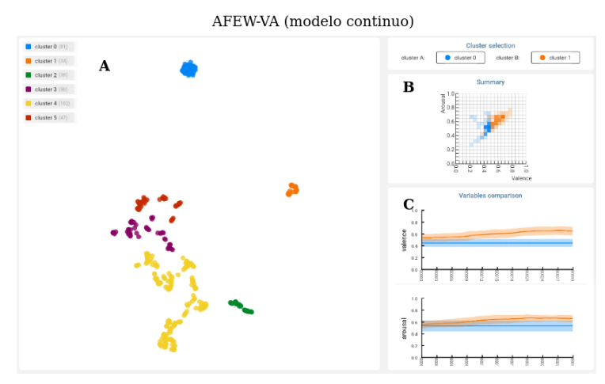
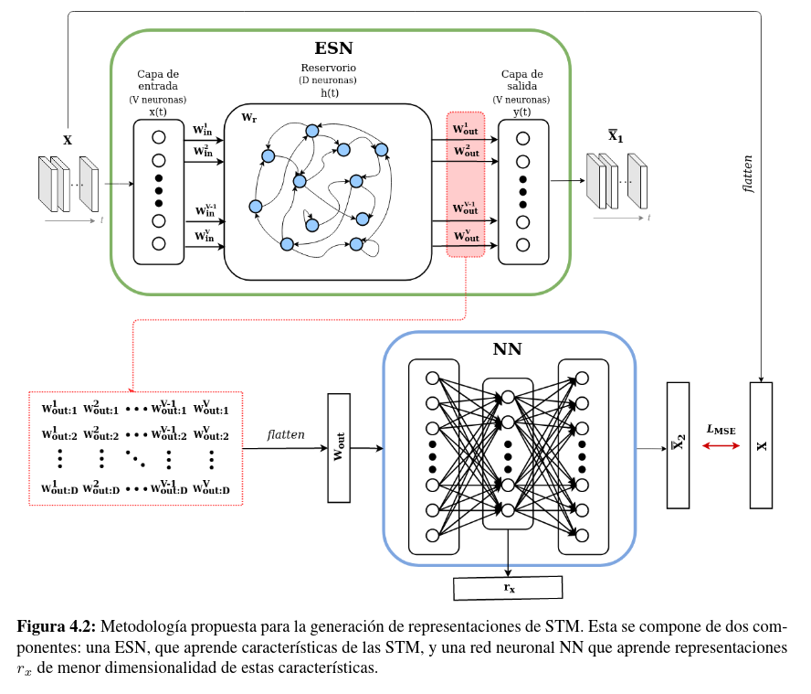
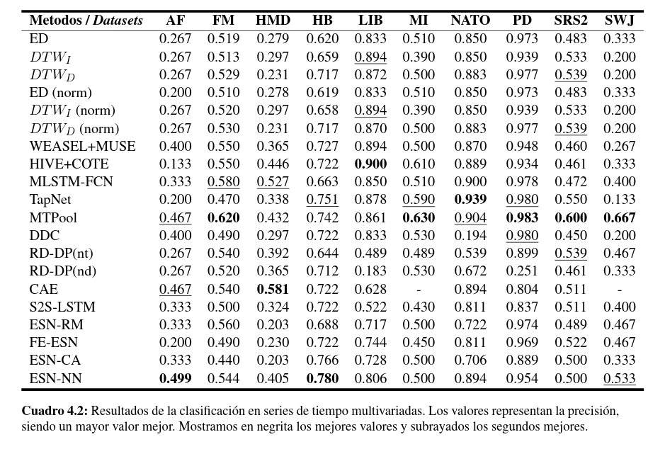
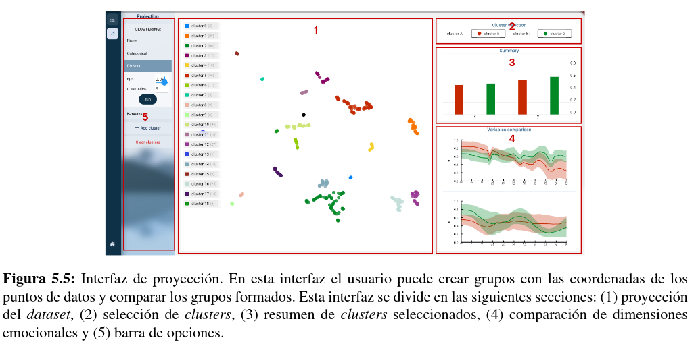

[![Contributors][contributors-shield]][contributors-url]
<!-- [![Forks][forks-shield]][forks-url]
[![Stargazers][stars-shield]][stars-url]
[![Issues][issues-shield]][issues-url]
[![MIT License][license-shield]][license-url] -->
[![LinkedIn][linkedin-shield]][linkedin-url]

<!-- PROJECT LOGO -->
 

  

<h3 align="center">EmoViz: A Tool for visualizing time series of emotions derived from physiological data</h3>

  

    This project has the tool and experiments implemented for my thesis.
     
  

<!-- ABOUT THE PROJECT -->
## About The Project

<!-- [![Product Name Screen Shot][product-screenshot]](https://example.com) -->

The tool allows the users to visualize the time series of emotions derived from physiological data using 2D projections to explore them. It also has multiples visualizations implemented for emotions.

We also include the method we developed to create multivariate time series representations using Echo State Networks and feed-forward Neural Networks, the architecture is the following:

The accuracy of our representations on a classification task compare to other methods:

We will later make the manuscript available.

Tested with python-3.7.12

(<a href="#top">back to top</a>)

### Built With

* [Pytorch](https://pytorch.org/)
* [Flutter](https://flutter.dev/)
* [Flask](https://flask.palletsprojects.com/en/2.0.x/)

(<a href="#top">back to top</a>)

### Requeriments
1. git
`$sudo apt-get install git`

2. python-dev
`$sudo apt-get install python-dev`

### Installation
- Clone the repository
`$git clone https://github.com/texsmv/emotion_vis_server`
- Enter to the repository dir
`$cd emotion_vis_server`
- Create an environment
`$python3 -m venv eviz`
- Activate the environment
`$source eviz/bin/activate `
- Install the server requirements
`$pip install -r requirements.txt`

## Usage
### Start the flask server
- Be sure to activate the environment
`$source eviz/bin/activate `
- Run the local server
`$python main.py`

### Start the http server
- Go to the ui directory
`$cd ui`
- Run an http server
`$python -m http.server`
- Open the adress http://0.0.0.0:8000/ in a web browser. And that's all!

### Example

<!-- CONTACT -->
## Contact

Alexis Mendoza - amendozavil@unsa.edu.pe - alexis@paulonia.dev

Project Link: [https://github.com/texsmv/emotion_vis](https://github.com/texsmv/emotion_vis)

(<a href="#top">back to top</a>)

<!-- MARKDOWN LINKS & IMAGES -->
<!-- https://www.markdownguide.org/basic-syntax/#reference-style-links -->
[contributors-shield]: https://img.shields.io/github/contributors/github_username/repo_name.svg?style=for-the-badge
[contributors-url]: https://github.com/texsmv/lsbp_background_subtraction/graphs/contributors
[forks-shield]: https://img.shields.io/github/forks/github_username/repo_name.svg?style=for-the-badge
[forks-url]: https://github.com/github_username/repo_name/network/members
[stars-shield]: https://img.shields.io/github/stars/github_username/repo_name.svg?style=for-the-badge
[stars-url]: https://github.com/github_username/repo_name/stargazers
[issues-shield]: https://img.shields.io/github/issues/github_username/repo_name.svg?style=for-the-badge
[issues-url]: https://github.com/github_username/repo_name/issues
[license-shield]: https://img.shields.io/github/license/github_username/repo_name.svg?style=for-the-badge
[license-url]: https://github.com/github_username/repo_name/blob/master/LICENSE.txt
[linkedin-shield]: https://img.shields.io/badge/-LinkedIn-black.svg?style=for-the-badge&logo=linkedin&colorB=555
[linkedin-url]: https://www.linkedin.com/in/alexismv/
[product-screenshot]: images/screenshot.png

